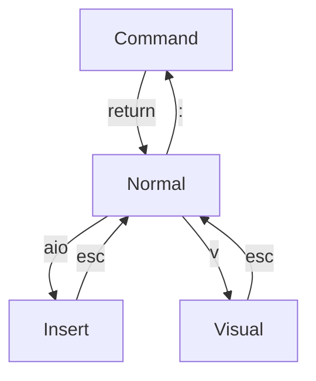

# Vim Helper

## Mode Overview

## control page view

| ctrl | comment |
| --- | --- |
| f | page forward |
| b | page backward |
| a | increment number under cursor by one |
| x | decrement number under cursor by one |
| v | vertical select for group action like *$A;* for appending ; to each line end |
| e | exit nvim to tmux |
| f | find file with telescope |
| g | search files with grep |

## Command

enter *Command* mode with : from *Normal* mode

| command | comment  |
| --- | --- |
| :w | write file |
| :q! | exit file without save |
| :wq | write file and exit |
| :0 | jump to first line |
| :$ | jump to last line |
| :% | use full file for operation |
| :! | perform Unix operator from shell |
| :%s/search/subst/gc | use file, substitute *search* with *subst* globally with confirmation | 
| :reg | show registers |
| :norm Ivar | adds *var* to the beginning of each line, in visual mode |
| :set relativenumber | change line numbering to relative |
| :put q | paste register q to cursor position |
| :so | source current file |
| :sort | sort all lines in visual mode |
| :sort! u | sort in reverse order and make unique |
| :Lazy | open lazy paket manager |

## Normal

Enter *Normal* mode with esc from *Insert* or * Visual* mode

Enter *Normal* mode with return from *Command* mode

| motion | comment |
| --- | --- |
| gg | jump to first line |
| G | juump to last line |
| zz | vertical center the view |
| H | jump to top line |
| L | jump to bottom line |
| h j k l | left, down, up, right |
| w | next word |
| W | next whitespace |  
| b | prev word |
| 0 | jump to first column in line |
| _ | jumps to the first character in the current line |
| $ | jump to last character in line |
| / | search all occurances of string |
| * | search all occurances of word under cursor |
| n | next occurance |
| N | prev occurance |
| f | find first element in current line |
| % | jump to matching bracket ([{ |
| = | correct indenting for visual area |

| Enter Insert Mode | comment |
| --- | --- |
| a | append after cursor + enter insert mode |
| A | append at eol + enter insert mode |
| i | insert before cursor + enter insert mode |
| I | insert on left most column + enter insert mode |
| o | new line after + enter insert mode |
| O | new line before + enter insert mode |

| Enter Visual Mode | comment |
| --- | --- |
| v | enter visual mode for character selection |
| V | enter visual mode for line selection |
| vG | enter visual mode from current line till file end |
| vi( | visual mode for everything inside bracket |
| vt= | visual mode for everything up to = |

| Editing | comment |
| --- | --- |
| dd | delete line + put in register 0-9 | 
| yy | yank line + put in register 0-9 |
| x | delete char after cursor + put in register |
| X | delete char before cursor |
| ~ | toggle uppper/lower case under cursor |
| c | change mode |
| p | paste after cursor |
| P | paste before cursor |
| u | undo last action |
| . | redo last action |
| J | joins currnet and next line to one line with space |
| gv | reselect previous visual selection |
| ga | provide ASCII under cursor |
| gx | open URL under cursor in browser |
| gf | open text file under cursor |
| guu | make line lower case |
| gUU | make line upper case |
| gg=G | jump to first line + correct indentation until last line |

| delete/yank/change area | comment |
| --- | --- |
| diw | delete inner word |
| yiw | yank inner word |
| ciw | change inner word |
| di( | delete inner bracket |
| yi( | yank inner bracket |
| ci( | change inner bracket |
| da" | delete outer "" |
| ya" | yank outer "" |
| dt= | delete to = |
| ct= | change to = |
| yt= | yank to = |
| cW | change all up to next whitespace |

| Markers | comment |
| --- | --- |
| mm | set mark m at current cursor |
| 'm | jump to m mark |
| '. | jump to position of last change |
| '' | jump to position before last jump |

| Register | comment |
| --- | --- |
| "1diw | delete word into register 1|
| "*d | delete visual mode into clipboard |
| "1yiw | yank word into register 1 |
| "*y | yank into clipboard |
| "1p | paste from register 1 |
| "*p | paste from clipboard |

| Markros | comment |
| --- | --- |
| qa.q | start makro with name *a* and record . |
| @a | replay makro with name *a* |
| 3@a | replay makro with name *a* 3 times |

## Visiual

| command | comment |
| --- | --- |
| > | shift one tab right |
| < | shift one tab left |
| 3> | shift 3 tabs right |
| 3< | shift 3 tabs left |
| d | delete + put in register |
| y | yank + put in register |
| J | joins lines in visual mode to one line |
